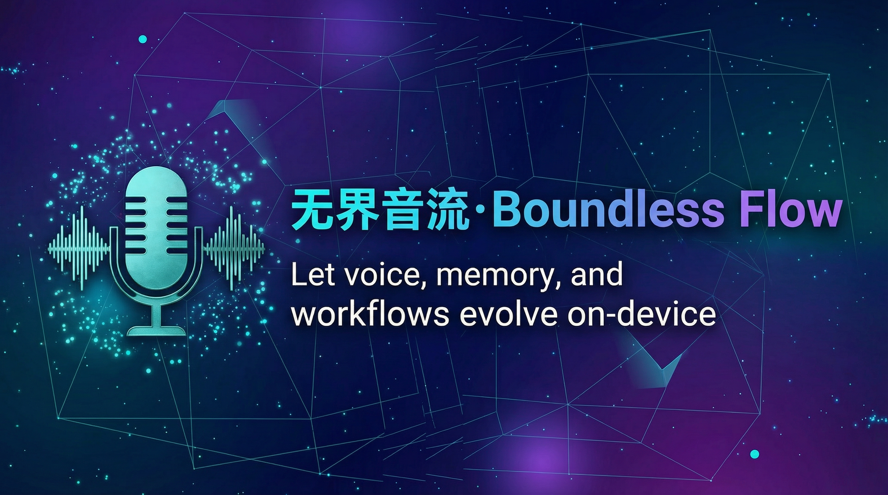
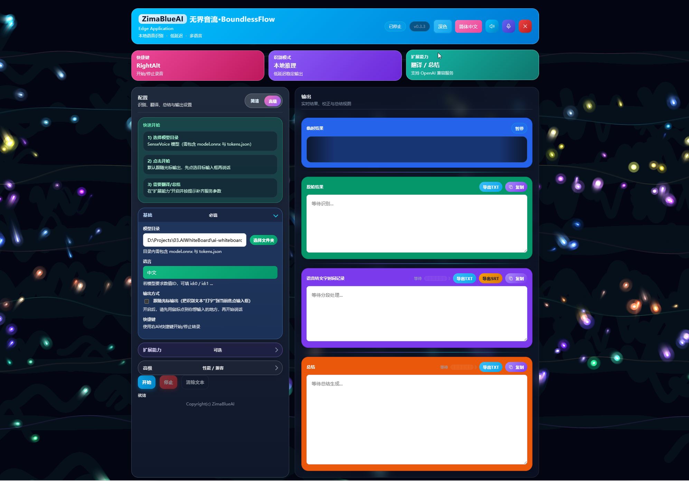

<div align="center">

<picture>
  
</picture>
<a href="http://boundless-flow.zimablueai.com">Website</a> · <a href="https://github.com/ZimaBlueAI/boundless-flow">GitHub</a> · <a href="https://github.com/ZimaBlueAI/boundless-flow/issues">Issues</a> · <a href="https://boundless-flow.github.io/docs">Docs</a>


[![][release-shield]][release-link]
[![][github-stars-shield]][github-stars-link]
[![][github-issues-shield]][github-issues-shield-link]
[![][github-contributors-shield]][github-contributors-link]
[![][license-shield]][license-shield-link]
[![][last-commit-shield]][last-commit-shield-link]

👋 Join our Community

📱 <a href="docs/images/lark-group.jpg">Lark Group</a> · <a href="#">WeChat</a> · <a href="https://discord.gg/mJphrXatyK">Discord</a> 

</div>

---

# 无界音流 / Boundless Flow

一款专为提升创作与记录效率而设计的桌面端智能语音助手。基于 Tauri 2（Rust 后端）+ Vite（TypeScript 前端），提供流畅的实时 **STT（SenseVoice ONNX / FunASR 本地推理）** 和强大的 **TTS（Rust libtorch + Python Bridge + 本地/云端模型）** 体验，全程运行在您的本地设备上，保护隐私。

## 项目概述

- **核心能力**：端侧实时录音与识别（支持光标跟随注入）、实时翻译、AI 纠错与智能总结、文字转语音与声音克隆
- **主要技术栈**：Tauri 2（Rust）、Vite（TypeScript）、ONNX Runtime（Rust `ort`）、Python（PyTorch/Transformers）
- **适用场景**：会议/访谈记录、双语字幕、边说边写（输入框注入）、配音与声音克隆

## 功能特性

###  实时语音转文字（STT）
- SenseVoice ONNX 与 FunASR 本地推理，支持实时输出与最终结果输出
- 升级后的 `native-stt` 支持离线音频文件转写，可切换 Whisper / SenseVoice 原生后端
- 三种输出方式：**跟随光标注入**（推荐）/ **实时输出** / **最终自动回车**
- 全局热键 `RightAlt` 随时开启/停止录音
- 支持语言：`auto` / `zh` / `en` / `yue` / `ja` / `ko` / `nospeech`
- Mini Mode：右下角悬浮实时字幕窗口

下载 STT 模型（SenseVoice ONNX）：[SenseVoiceSmall](https://github.com/FunAudioLLM/SenseVoice)
```
modelscope download --model iic/SenseVoiceSmall --local_dir ./SenseVoiceSmall
```

下载 STT 模型（FunASR）：
```
modelscope download --model FunAudioLLM/Fun-ASR-Nano-2512 --local_dir ./Fun-ASR-Nano-2512
```

###  实时翻译
- 内置翻译代理，支持 Ollama / OpenAI 兼容接口
- 推荐本地翻译模型：`ZimaBlueAI/HY-MT1.5-1.8`（Ollama）
- 双语字幕同屏显示；支持流式输出
- 翻译策略可选：仅翻译最终结果（省 API 额度）或同时翻译实时结果

###  AI 纠错与智能总结
- **AI 纠错**（"智能校对"功能）：自动润色识别文字，可配置并发线程数（默认 2，最大 4）
- **智能总结**：定时生成会议/录音摘要（建议间隔 60 秒），结果以树状或队列形式展示
- 支持 OpenAI / Ollama / 火山引擎 等后端；推荐本地模型：`qwen3:4b`

###  语音合成与声音克隆（TTS）
- **Qwen3-TTS**  三种模式：
  - `Base`：标准高质量合成，无需参考音频
  - `CustomVoice`：5-15 秒参考音频即可克隆音色
  - `VoiceDesign`：文本提示词"捏"出新音色（无需参考音频）
- **Index-TTS2**  情感向量控制 + 提示词引导，让克隆声音更有感情
- **云端 API 支持**：
  - 火山引擎（Volcengine）：丰富高质量音色，支持多方言/外语
  - OpenAI TTS：alloy / echo / fable / onyx / nova / shimmer
  - MiniMax：极具表现力的语音大模型
- TTS 运行时可打入完整安装包，也支持 Lite 包 + 按需下载

###  其他
- 系统托盘：关闭窗口可隐藏到托盘，随时从托盘菜单恢复或退出

## 快速开始

### 普通用户（Release）

1. 下载并安装最新 Release 安装包，双击启动
2. 打开设置，选择 STT 后端（`onnx` 或 `funasr`），并将 **模型目录** 指向对应模型文件夹
3. 按下 `RightAlt` 开始录音

如果您要转写现有音频文件，而不是实时麦克风输入，可在 STT 面板把后端切换到 `Whisper` 或 `SenseVoice`，再选择模型文件与音频文件。

模型下载与常见问题见 [INSTALL.md](INSTALL.md)。

### 开发者（本地调试）

```powershell
cd /path/to/boundless-flow
pnpm install
pnpm run tauri:dev
```

完整环境准备（Rust/MSVC、Python/TTS、Lite 包、打包与产物路径）见 [INSTALL.md](INSTALL.md)。

## 使用指南

### STT 配置项（应用内）

| 配置项 | 说明 | 建议 |
| --- | --- | --- |
| 模型目录 | ONNX 后端需包含 `model.onnx`、`tokens.json`；FunASR 后端需指向完整 `Fun-ASR-Nano-2512` 目录 | 指向具体模型目录 |
| 后端 | `onnx` / `funasr` 用于实时麦克风识别，`whisper` / `sensevoice` 用于 native-stt 离线文件转写 | 实时字幕建议使用 `onnx` 或 `funasr` |
| 发送帧间隔（ms） | 音频帧发送频率，越小越接近实时但更吃 CPU | `20ms` |
| 识别语言 | auto/zh/en/yue/ja/ko/nospeech | `auto` |
| TextNorm | 文本标准化 | `auto` |
| 输出方式 | 跟随光标注入 / 实时输出 / 最终自动回车 | 依使用场景选择 |

> 平台不支持时会自动降级（例如"跟随光标注入"在部分平台不可用）。
>
> `native-stt` 当前定位是上传音频文件后的离线转写能力，不替代实时麦克风字幕链路；实时麦克风字幕请使用 `onnx` 或 `funasr`。

### 翻译配置项

| 配置项 | 示例值 |
| --- | --- |
| 翻译 API Base URL | `http://localhost:11434/v1`（Ollama）/ `https://api.openai.com/v1` |
| 翻译模型 | `ZimaBlueAI/HY-MT1.5-1.8` / `gpt-4o-mini` / `translategemma` |
| 翻译 API Key | Ollama 可留空 |
| 流式输出 | 推荐开启（本地模型体验更平滑） |

### AI 纠错与总结配置项

| 配置项 | 说明 | 示例 |
| --- | --- | --- |
| 启用纠错及文字总结（LLM） | 总开关 | 勾选 |
| 总结服务商 | OpenAI / Ollama / 火山引擎 | Ollama |
| 总结 API Base URL | 服务地址 | `http://localhost:11434/v1` |
| 总结模型 | 模型标识 | `qwen3:4b` / `doubao-seed-1-6` |
| 纠错并发线程数 | 1-4 | `2` |
| 总结更新间隔（秒） | 生成摘要的频率 | `60` |

### TTS 模型下载（ModelScope）

**Qwen3-TTS：**
```bash
modelscope download --model Qwen/Qwen3-TTS-12Hz-1.7B-Base --local_dir ./Qwen/Qwen3-TTS-12Hz-1.7B-Base
modelscope download --model Qwen/Qwen3-TTS-12Hz-1.7B-CustomVoice --local_dir ./Qwen/Qwen3-TTS-12Hz-1.7B-CustomVoice
modelscope download --model Qwen/Qwen3-TTS-12Hz-1.7B-VoiceDesign --local_dir ./Qwen/Qwen3-TTS-12Hz-1.7B-VoiceDesign
```

**Index-TTS2：**
```bash
modelscope download --model IndexTeam/IndexTTS-2 --local_dir ./IndexTeam/IndexTTS-2
```

下载后，在设置里将 **TTS 模型目录** 指向对应模型文件夹。

### TTS 云端 API 配置（以火山引擎为例）

在设置中选择 **Volcengine TTS（火山引擎）** 后填写：

| 字段 | 说明 |
| --- | --- |
| AppId | 火山引擎应用标识 |
| Token | 访问令牌 |
| Cluster | 集群标识（如 `volcano_tts`） |
| VoiceType | 音色标识 |

可选：UID、音频格式（Encoding）、采样率（Rate）、语速/音量/音高倍率、情感（Emotion）等。

## API 文档（简要）

Boundless Flow 前端通过 Tauri `invoke` 调用后端命令，关键命令包括：

- 配置：`get_app_config` / `set_app_config`
- 录音：`start_listening` / `stop_listening`
- 注入：`inject_text`
- 翻译代理：`translate_via_backend`
- TTS：`tts_generate` / `tts_read_audio_base64`

后端实现入口在 [src-tauri/src/main.rs](src-tauri/src/main.rs)。

## 目录结构

- 前端：`src/`（Vite）
- Rust 后端：`src-tauri/`
- Python Bridge（TTS）：`src-tauri/python/`
- Tauri 配置：`src-tauri/tauri.conf.json`（以及平台特化配置）
- 文档：`docs/`（详细用户指南，含中英文版）

## 文档速览

- `docs/index.html`：文档入口与核心能力概览
- `docs/stt.html`：实时 STT 与模型配置说明
- `docs/translation.html`：实时翻译流程与设置项
- `docs/proofreading-summary.html`：AI 纠错与智能总结
- `docs/tts-voice-cloning.html`：语音合成与声音克隆
- `docs/appendix.html`：模型下载、API 配置小白指南
- `docs/context-landing.html`：设计哲学、快速开始与最佳实践展示页

英文版文档位于同目录下的 `*-en.html`。

## 贡献指南

提交前本地检查：

```powershell
cd /path/to/boundless-flow
pnpm run type-check
pnpm run build
pnpm run tauri:build
pnpm run tauri:bundle
```

建议提交内容：单一目标、可复现步骤、截图/日志（如与 UI/音频相关）。

## 界面预览



---

Copyright  2026 ZimaBlueAI & WaytoAGI-dev. All rights reserved.  

<!-- Link Definitions -->

[release-shield]: https://img.shields.io/github/v/release/ZimaBlueAI/boundless-flow?color=369eff&labelColor=black&logo=github&style=flat-square
[release-link]: https://github.com/ZimaBlueAI/boundless-flow/releases
[license-shield]: https://img.shields.io/badge/license-apache%202.0-white?labelColor=black&style=flat-square
[license-shield-link]: https://github.com/ZimaBlueAI/boundless-flow/blob/main/LICENSE
[last-commit-shield]: https://img.shields.io/github/last-commit/ZimaBlueAI/boundless-flow?color=c4f042&labelColor=black&style=flat-square
[last-commit-shield-link]: https://github.com/ZimaBlueAI/boundless-flow/commits/main
[github-stars-shield]: https://img.shields.io/github/stars/ZimaBlueAI/boundless-flow?labelColor&style=flat-square&color=ffcb47
[github-stars-link]: https://github.com/ZimaBlueAI/boundless-flow
[github-issues-shield]: https://img.shields.io/github/issues/ZimaBlueAI/boundless-flow?labelColor=black&style=flat-square&color=ff80eb
[github-issues-shield-link]: https://github.com/ZimaBlueAI/boundless-flow/issues
[github-contributors-shield]: https://img.shields.io/github/contributors/ZimaBlueAI/boundless-flow?color=c4f042&labelColor=black&style=flat-square
[github-contributors-link]: https://github.com/ZimaBlueAI/boundless-flow/graphs/contributors
